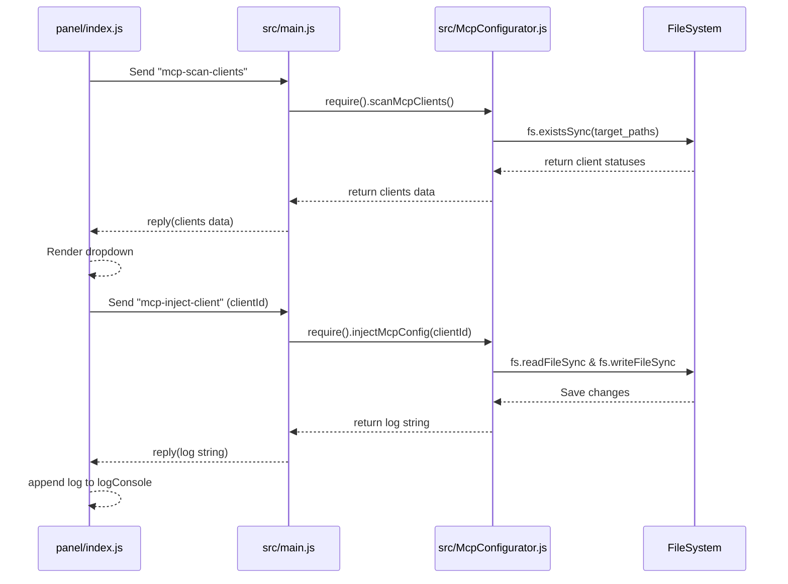

# 实施计划: 自动化添加MCP设置

## 1. 架构设计 (Architecture)

### 文件清单表格
| 文件路径 | 所属层级 | 改动性质 | 一句话说明 |
|----------|----------|----------|------------|
| `src/McpConfigurator.js` | [Backend] | 新增 | 负责侦测当前操作系统的 AI 客户端配置文件路径并执行 JSON 安全注入的封装核心。 |
| `src/main.js` | [Backend] | 修改 | 注册 IPC 事件总线 `mcp-scan-clients` 和 `mcp-inject-client`，桥接后端方法。 |
| `panel/index.html` | [Frontend] | 修改 | 追加一个 "MCP 配置" 的界签 (Tab) 及其附属的下拉列表、操作按钮 UI 元素。 |
| `panel/index.js` | [Frontend] | 修改 | 绑定 UI 页签交互，以及向 Node.js 发送请求，更新配置情况页面显示逻辑。 |

### 架构影响评估
> [!NOTE]
> 本次改动不涉及架构变更。全量增量在现有 `main.js`（IPC双工调度）与 `panel/index.html/js`（MVVM-lite式 DOM 操纵）框架下执行，并未引入任何可能阻塞 Cocos Creator 原生渲染和数据流管道的破坏性架构。

### 关键流程图


## 2. 分步实施 (Step-by-Step)

### 阶段 A: 代码修改

- [x] [Backend] 创建底层配置业务流文件 `src/McpConfigurator.js`。
  ```javascript
  // 核心改动片段示例 (新增文件)
  const fs = require('fs');
  const pathModule = require('path');
  const isWin = process.platform === 'win32';
  // 查找配置存放路径
  const getUserProfilePath = () => process.env.USERPROFILE || process.env.HOME || '';
  
  function scanMcpClients() {
      // 执行系统磁盘查询和 JSON 校对检测...
      return [];
  }
  function injectMcpConfig(clientId) {
      // 执行注入并重写回 JSON
      return "✅ 配置注入成功";
  }
  module.exports = { scanMcpClients, injectMcpConfig };
  ```

- [x] [Backend] 在 `src/main.js` 扩展 IPC 消息入口，通过反射绑定配置业务流。
  ```javascript
  // 改动前
  manageAnimation(args, callback) {
      callSceneScriptWithTimeout("mcp-bridge", "manage-animation", args, callback);
  },
  
  // 改动后
  manageAnimation(args, callback) {
      callSceneScriptWithTimeout("mcp-bridge", "manage-animation", args, callback);
  },
  "mcp-scan-clients"(event) {
      try {
          const { scanMcpClients } = require('./McpConfigurator');
          if (event.reply) event.reply(null, scanMcpClients());
      } catch (e) {
          if (event.reply) event.reply(new Error(e.message));
      }
  },
  "mcp-inject-client"(event, clientId) {
      try {
          const { injectMcpConfig } = require('./McpConfigurator');
          const log = injectMcpConfig(clientId === -1 ? undefined : clientId);
          if (event.reply) event.reply(null, log);
      } catch (e) {
          if (event.reply) event.reply(null, "写入报错: " + e.message);
      }
  }
  ```

- [x] [Frontend] 修改 `panel/index.html`，在头部注入新 `tab-button` 并在体部加入新面板容器节点。
  ```html
  <!-- 头部选项卡新增 -->
  <ui-button id="tabIpc" class="tab-button">IPC 测试</ui-button>
  <ui-button id="tabConfig" class="tab-button">MCP 配置</ui-button>
  
  <!-- 下方补充实体 -->
  <div id="panelConfig" class="tab-content" style="padding: 15px; color: #ccc;">
      <h4 style="margin: 0 0 15px 0;">⚡ 自动化工具链配置</h4>
      <div style="margin-bottom: 20px; display: flex; align-items: center; gap: 8px;">
         <label>宿主平台:</label>
         <select id="mcpClientSelect" style="width:160px;"></select>
      </div>
      <div id="mcpConfigStatus" style="margin-bottom: 15px;">等待扫描...</div>
      <ui-button id="btnInjectMcp" class="green">一键配置</ui-button>
      <hr style="border-color: #444; margin: 20px 0;">
      <ui-button id="btnInjectAll">尝试向所有平台分发</ui-button>
  </div>
  ```

- [x] [Frontend] 修改 `panel/index.js`，实现 `tabConfig` 选项卡的点击映射及挂载逻辑，并请求 IPC 数据动态填实下拉框。

### 阶段 B: 编译验证

- [x] [Build] 执行 `npm run build` 确认编译通过（注：针对原生态 JS 的 Cocos Creator 项目，此脚本若不存在或为免构建状态下，请忽略或采用 `npm i` 验证包完整性并依赖控制台无报错输出为准）。
- [x] [Frontend] 在 Cocos Creator 编辑器中通过 “扩展 -> 刷新” 重启本插件。

### 阶段 C: 文档更新

- [x] [Docs] 更新 `UPDATE_LOG.md`，追加新增一键注入自动化配置的功能条目。
- [x] [Docs] 更新 `README.md`，在功能列表中补充“快捷探测与适配宿主 AI MCP 设置”的配置参考。
