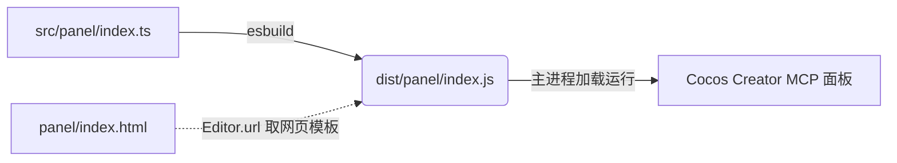

# 架构设计 (Architecture)

## 涉及文件清单
| 文件名 | 所属层级 | 改动性质 | 说明 |
| :--- | :--- | :--- | :--- |
| `src/panel/index.ts` | [Frontend] | 新增 | 从原 `panel/index.js` 迁移并转换成 TypeScript |
| `panel/index.js` | [Frontend] | 删除 | 舍弃项目根处的散装 js 构建逻辑，被 dist 生成版替代 |
| `package.json` | [Build] | 修改 | 修正 npm package 的 build 指令，指向正确的 TS 入口 |
| `tsconfig.json` | [Build] | 检查 | 保证 `src/panel` 被涵括进入配置的检查阵列 |

## 架构影响评估
> [!NOTE]
本次改动核心为工程目录结构与构建体系的收缩归一化，不涉及系统深层的数据模型、状态管理逻辑或者主要的 IPC 通信链路层变更，无架构变更风险。

## 关键流程图


# 分步实施步骤 (Step-by-Step)

### 阶段 A: 构建体系预备
- [x] [Build] 修改 `package.json` 里的构建脚本，将构建源从 `panel/index.js` 变更为 `src/panel/index.ts`
```json
// package.json修改前
"build": "tsc && esbuild src/main.ts ... && esbuild panel/index.js --bundle --platform=node --external:electron --outfile=dist/panel/index.js ..."

// package.json修改后
"build": "tsc && esbuild src/main.ts ... && esbuild src/panel/index.ts --bundle --platform=node --external:electron --outfile=dist/panel/index.js ..."
```
- [x] [Build] 检查 `tsconfig.json` 确认是否需要显式添加 `src/panel/**/*.ts` (若涵盖于 `src/**/*.ts` 则跳过)

### 阶段 B: UI 源码迁移与 TS 改写
- [x] [Frontend] 将 `panel/index.js` 文件移动至 `src/panel/index.ts`
- [x] [Frontend] 在 `src/panel/index.ts` 中修正顶层的依赖导入方式，从 `require` 转变为严格的 `import` ES Module 结构：
```typescript
// 改动前
const fs = require("fs");
const { IpcUi } = require("../src/IpcUi");

// 改动后
import * as fs from "fs";
import { IpcUi } from "../IpcUi";
```
- [x] [Frontend] 为 `src/panel/index.ts` 中的 DOM 选择与方法调用添加必要的强制类型断言 (如 `as HTMLInputElement` 或 `as HTMLElement`)，以压制强类型语言引发的 Error 警告。
- [x] [Frontend] 删除已经完成使命的原生根目录 `panel/index.js` 裸辞源文件。

### 阶段 C: 本地编译与验证
- [x] [Build] 执行全量类型硬检：运行 `npx tsc --noEmit`，确保无剩余因本次 UI 迁移而诱发的类型报错残存。
- [x] [Build] 执行构建流程验证：运行 `npm run build` 命令，验证 ESBuild 集成打包链是否能成功输出 `dist/panel/index.js` 且不报错。

### 阶段 D: 文档更新
- [x] [Docs] 更新 `UPDATE_LOG.md` 版本号及详情，记录 "将扩展面板代码迁移到 TypeScript src 目录并纳入 ESBuild 构建体系" 工作记录。
