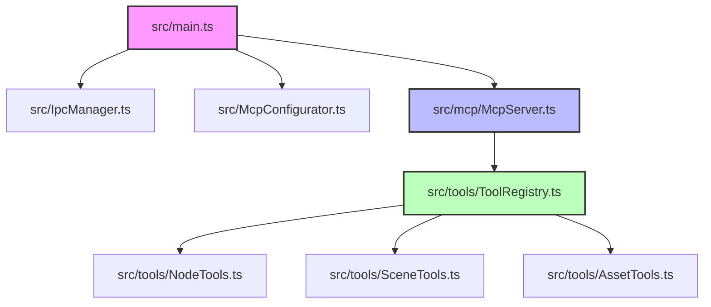

# mcp-bridge 项目结构优化实施计划

## 1. 架构设计 (Architecture)

### 架构影响评估
> [!NOTE]
> 本次改动核心在于工程级别的改造（引入 TypeScript、ESBuild 模块化以及调整目录结构），不涉及具体业务逻辑层架构的心智模型或核心状态处理链路的修改。所有底层通信（IPC）机制与工具处理流程在重构成模块化封装时，将保持既有接口形式和行为的一致性。

### 关键流程图


### 文件清单表格

| 文件路径/模式 | 所属层级 | 改动性质 | 说明 |
| --- | --- | --- | --- |
| `package.json` | [Build] | 修改 | 引入构建依赖 `typescript`, `esbuild`，调整 `main` 和 `scene-script` 的入口路径为 dist |
| `tsconfig.json` | [Build] | 新增 | 配置 TS 编译规则（ES2018, CommonJS） |
| `src/globals.d.ts` | [Build] | 新增 | 增加全局类型声明 (如 `Editor`, `cc`) 避免编译报错 |
| `src/main.ts` | [Backend] | 修改/重构 | 抽离冗长逻辑，仅作为主进程的生命周期(load/unload)和 IPC 消息中转入口 |
| `src/scene-script.ts`| [Frontend]| 重命名/修改 | 渲染进程脚本转为 TypeScript，解决 `cc` 对象的相关报错 |
| `src/mcp-proxy.ts` | [Backend] | 重命名/修改 | 转换为 TypeScript，处理部分显式 any |
| `src/IpcManager.ts` | [Backend] | 重命名/修改 | 转换为 TypeScript，处理相关通信类型 |
| `src/IpcUi.ts` | [Backend] | 重命名/修改 | 转换为 TypeScript |
| `src/McpConfigurator.ts` | [Backend] | 重命名/修改 | 转换为 TypeScript |
| `src/mcp/McpServer.ts`| [Backend] | 新增 | 新建核心控制模块，收拢 MCP Server 实体及依赖生命周期 |
| `src/tools/*.ts` | [Backend] | 新增 | 按范畴（如 NodeTools, SceneTools）将现有的 MCP 暴露结构分解为多文件并集中注册 |
| `UPDATE_LOG.md` | [Docs] | 修改 | 记录本次通过 TS 与 esbuild 升级的工程重构日志 |

## 2. 分步实施 (Step-by-Step)

### 阶段 A: 构建环境搭建
- [x] [Build] **初始化 TS 和 ESBuild 依赖并在 package.json 指定构建命令与入口**
  修改主入口指向 `dist`，并增加 `build` 脚本以支持 `tsc` 和 `esbuild`。
  ```json
  {
    "main": "dist/main.js",
    "scene-script": "dist/scene-script.js",
    "scripts": {
      "build": "tsc && esbuild src/main.ts --bundle --platform=node --external:ws --external:@modelcontextprotocol/sdk --outfile=dist/main.js && esbuild src/scene-script.ts --bundle --platform=node --outfile=dist/scene-script.js"
    }
  }
  ```
- [x] [Build] **创建 TypeScript 配置文件 `tsconfig.json`**
  ```json
  {
    "compilerOptions": {
      "target": "es2018",
      "module": "commonjs",
      "strict": true,
      "esModuleInterop": true,
      "skipLibCheck": true,
      "forceConsistentCasingInFileNames": true,
      "outDir": "./dist",
      "rootDir": "./src"
    },
    "include": ["src/**/*"]
  }
  ```
- [x] [Build] **新增全局环境变量声明 `src/globals.d.ts`**
  预留全局对象绕过类型检查：
  ```typescript
  // src/globals.d.ts
  declare const Editor: any;
  declare const cc: any;
  declare const sp: any;
  declare const module: any;
  ```

### 阶段 B: 代码全量 TypeScript 化与重组
- [x] [Backend] **重命名辅助基础模块**
  将 `src/IpcManager.js` -> `src/IpcManager.ts` 及其它配套 JS (`mcp-proxy`, `IpcUi`, `McpConfigurator`) 变更为 TS 后缀，补全缺失的基础函数输入返回类型（或快速转换为 any）。
- [x] [Frontend] **重命名兼调整渲染层代码 `src/scene-script.ts`**
  将 `scene-script.js` 更名为 `.ts`，在必要的地方追加类型声明以免编译不通过。
- [x] [Backend] **抽离工具注册逻辑**
  创建 `src/tools/` 文件夹。根据工具的名称域抽离 `NodeTools.ts`, `ComponentTools.ts`, `SceneTools.ts`，将原来 `main.js` 对象硬编码结构导出为 `registerTools(server)` 方法。
- [x] [Backend] **瘦身 `main.ts`**
  通过重命名并剔除原本包含的所有服务器和工具代码，使其回归到纯粹承担 Cocos 扩展生命周期 `load()` / `unload()` 和 IPC `messages` 处理的指责。

### 阶段 C: 编译验证
- [x] [Build] **执行自动化构建脚本并验证输出**
  运行命令行 `npm run build` 构建项目。必须确认 `dist/main.js` 及 `dist/scene-script.js` 有正确输出，并在控制台排查所有阻塞编译的类型报错和打包错误。

### 阶段 D: 文档更新
- [x] [Docs] **更新重构开发日志 `UPDATE_LOG.md`**
  提交改动前更新日志文件并撰写发布内容：
  ```markdown
  ## [vX.X.X] - YYYY-MM-DD
  ### Refactor
  - 核心架构重构: 将原生 JavaScript 代码升级为 TypeScript，并加入 esbuild 进行分发打包。
  - 模块化拆分: 拆分 `main.js` 中极度冗长的工具注册与服务启动逻辑为独立的 `mcp` 与 `tools` 分支结构。
  ```
