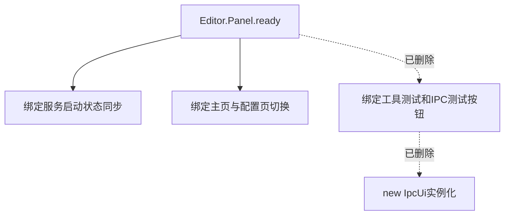

# 架构设计 (Architecture)

## 文件清单
| 文件名 | 所属层级 | 改动性质 | 说明 |
| :--- | :--- | :--- | :--- |
| `panel/index.html` | [Frontend] | 修改 | 移除 Tool Test / IPC Test 相关 HTML 元素及其附带的专用 CSS 块 |
| `src/panel/index.ts` | [Frontend] | 修改 | 卸掉相关测试代码和按钮绑定监听事件逻辑，不再生成和发送探病请求 |
| `src/IpcUi.ts` | [Frontend] | 删除 | 彻底删除整个原本只用来呈现 IPC 调试信息的渲染类文件 |

## 架构影响评估
> [!NOTE]
> 本次改动仅为做减法。目的是消除不再需要向通常用户暴露的内置“工具测试功能”等辅助界面，旨在简化运行负担与 UI，**本次变动不涉及架构变更**，也不会动摇已有核心数据状态和主要插件通讯生命周期。

## 关键流程图


# 分步实施步骤 (Step-by-Step)

### 阶段 A: HTML 界面与 CSS 回收
- [x] [Frontend] 修改 `panel/index.html` 顶部的 tab 声明，剔除测试选项卡的入口按钮：
```html
<!-- 改动前 -->
<div class="tabs">
    <ui-button id="tabMain" class="tab-button active">主页</ui-button>
    <ui-button id="tabTest" class="tab-button">工具测试</ui-button>
    <ui-button id="tabIpc" class="tab-button">IPC 测试</ui-button>
    <ui-button id="tabConfig" class="tab-button">MCP 配置</ui-button>
</div>

<!-- 改动后 -->
<div class="tabs">
    <ui-button id="tabMain" class="tab-button active">主页</ui-button>
    <ui-button id="tabConfig" class="tab-button">MCP 配置</ui-button>
</div>
```
- [x] [Frontend] 继续修改 `panel/index.html`，彻底删除原供渲染使用的实体面板区块，包含 `<div id="panelTest">...</div>` 以及 `<div id="panelIpc">...</div>` 两大 DOM 内容节点。
- [x] [Frontend] 将 `panel/index.html` 尾部 `<style>` 区间内仅用于调试测试页面的冗杂 CSS 删除。 (例如 `.test-layout`, `.resizer`, `.ipc-container`, 等相关选择器)

### 阶段 B: TS 代码依赖清理与类卸载
- [x] [Frontend] 从 `src/panel/index.ts` 的顶部移除对 `import { IpcUi } from "../IpcUi";` 的导入声明。
- [x] [Frontend] 物理抹除并整个删除 `src/IpcUi.ts` 文件本身。
- [x] [Frontend] 在 `src/panel/index.ts` 的 `ready()` 生命周期方法中移除所有和工具测试/IPC测试挂靠的功能事件。
```typescript
// 改动前 (需删除片段)
new IpcUi(root);
// ...
if (els.tabTest) {
    els.tabTest.addEventListener("confirm", () => {
        switchTab(els.tabTest, els.panelTest);
        this.fetchTools(els); 
    });
}
//...以及对于 btnScanIpc 等的一系列事件操作。
```
- [x] [Frontend] 在 `src/panel/index.ts` 下半段彻底删除不再被任何途径用到的内部函数实体，如 `fetchTools(els)`、`showToolDescription(els, tool)`、`runTest(els)` 和 `getExample(name)`。

### 阶段 C: 编译验证
- [x] [Build] 运行 `npx tsc --noEmit`，验证所有引用的删减是否彻底，确保没有因为误砍导致的其他关联节点空指针类 TS Error。
- [x] [Build] 执行 `npm run build` 完成全量编译打包环节，确保移除模块后 esbuild 的 entry graph 不会抛出无法引入的报错。

### 阶段 D: 文档更新
- [x] [Docs] 更新 `UPDATE_LOG.md` ，以规范格式简记：“移除测试与废弃的调试子面板，收拢精简化纯净交互流程”。
